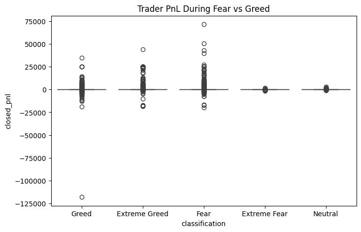
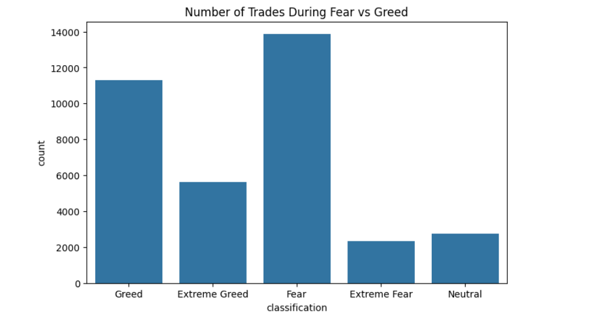
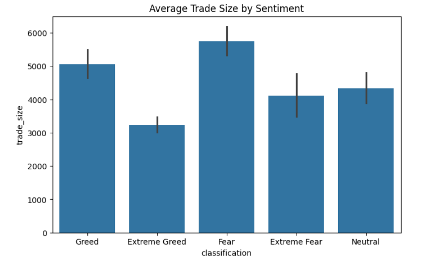
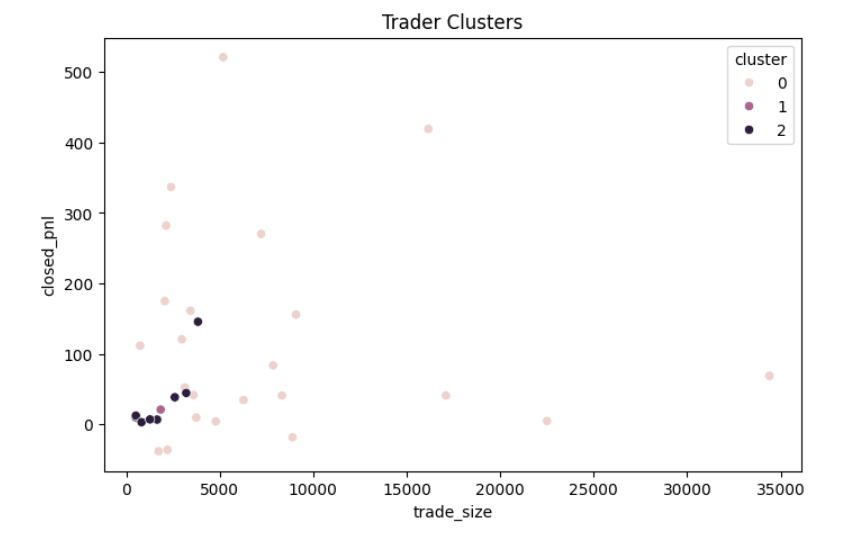

## 📂 Dataset

Due to size constraints, datasets are hosted externally:

- Historical Trading Data: [https://your-link](https://drive.google.com/file/d/1PgQC0tO8XN-wqkNyghWc_-mnrYv_nhSf/view?usp=sharing)
- Fear & Greed Index:  [https://drive.google.com/file/d/1IAfLZwu6rJzyWKgBToqwSmmVYU6VbjVs/view ](https://drive.google.com/file/d/1IAfLZwu6rJzyWKgBToqwSmmVYU6VbjVs/view)

- 
# Trader Performance vs Market Sentiment

## 📌 Objective

Analyze how market sentiment (Fear/Greed) impacts trader behavior and performance.

---

## ⚙️ Setup Instructions

1. Clone the repository
2. Install dependencies:

```
pip install pandas numpy matplotlib seaborn scikit-learn
```


## 🔧 Methodology

The analysis was conducted using two datasets: trader-level historical trading data and Bitcoin market sentiment (Fear/Greed index).

First, data cleaning was performed by standardizing column names, handling missing values, and converting timestamp fields into a common date format. Both datasets were then merged on the date column to align trading activity with daily market sentiment.

Key features were engineered to capture trader behavior and performance, including:

* Daily Profit & Loss (PnL)
* Win rate (profitable trades ratio)
* Trade size (USD)
* Trade frequency (number of trades per day)
* Long/Short activity

The analysis compared these metrics across different sentiment regimes (Fear vs Greed). Additionally, trader segmentation and a simple predictive model were implemented as part of the extended analysis.

---

## 🔍 Key Insights

1. **Market sentiment impacts profitability**
   Traders generally achieve higher average PnL during *Greed* periods, indicating favorable market conditions.

2. **Behavior shifts during Fear periods**
   During Fear phases, traders tend to reduce their activity by lowering trade size and frequency, reflecting cautious behavior.

3. **Risk-return tradeoff among traders**
   Traders with larger position sizes generate higher profits on average but also experience greater volatility and potential losses.

4. **Trading activity increases in Greed markets**
   The number of trades and overall participation tends to rise when market sentiment is positive.

---

## 💡 Strategy Recommendations

1. **Adopt a defensive strategy during Fear periods**
   Traders should reduce position sizes, avoid high leverage, and focus on capital preservation during uncertain market conditions.

2. **Leverage opportunities during Greed periods with caution**
   Increased trading activity can be beneficial in bullish conditions, but strict risk management (e.g., stop-loss) is essential to avoid large drawdowns.

3. **Segment-based strategy optimization**
   High-frequency or high-volume traders can capitalize on momentum during Greed phases, while low-risk traders should maintain consistent, smaller trades across all conditions.

---

## ✅ Conclusion

The analysis demonstrates that market sentiment significantly influences trader behavior and performance. By adapting strategies based on sentiment signals, traders can improve decision-making and manage risk more effectively.

---

## 🚀 Bonus Work

* Built a simple predictive model to classify profitable trades
* Clustered traders into behavioral segments

---

## 📊 Results

### Trader PnL During Fear vs Greed


### Number of Trades During Fear vs Greed


### Average Trade Size by Sentiment


### Trader Clusters



---
